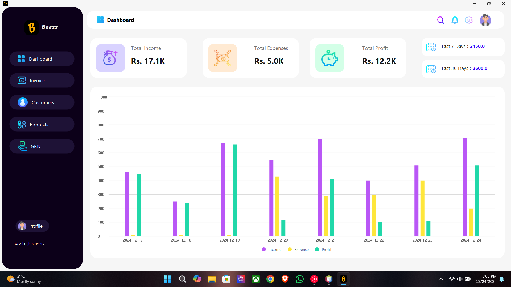
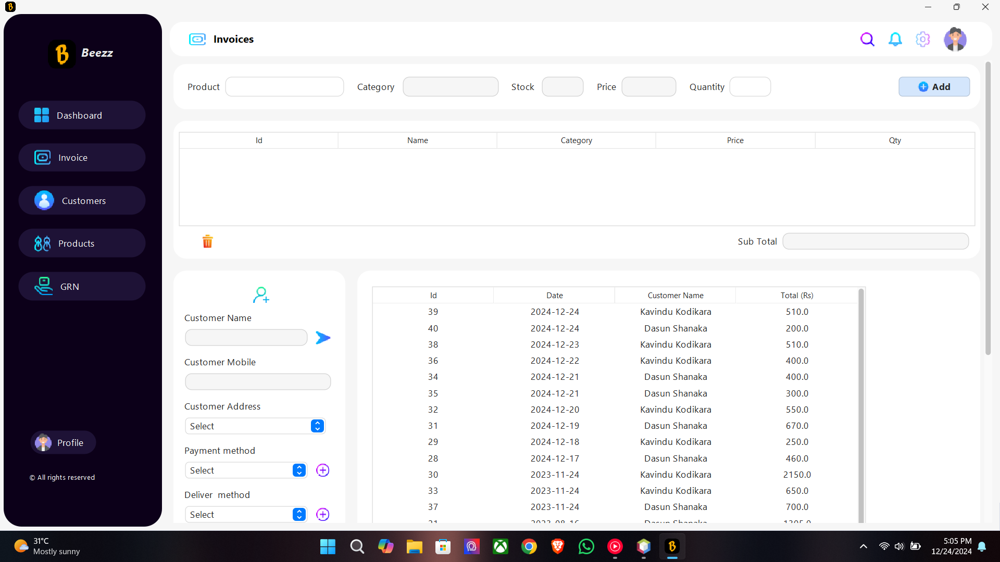
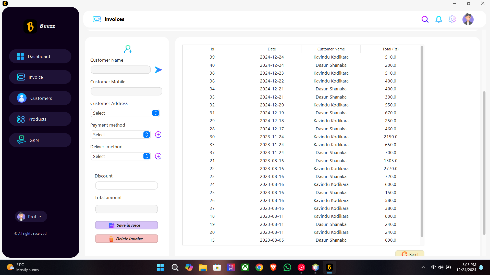
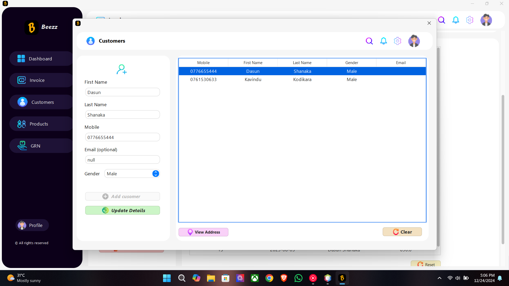
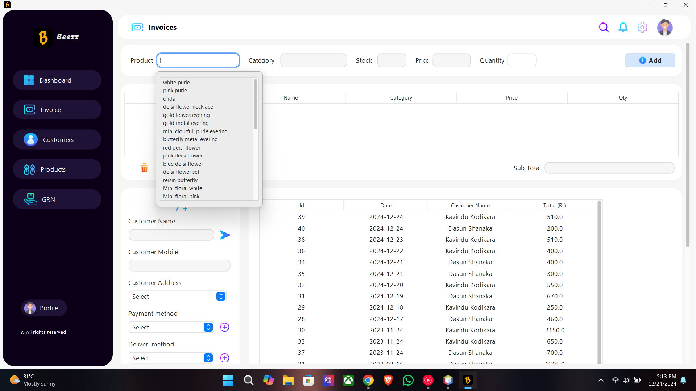
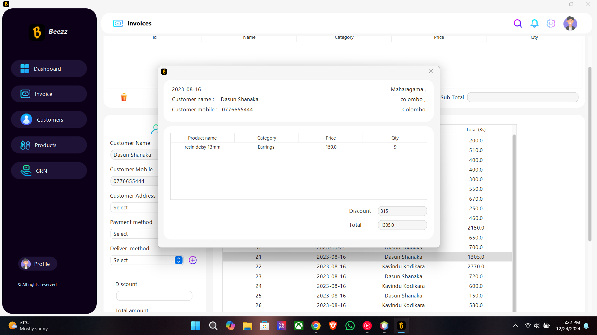
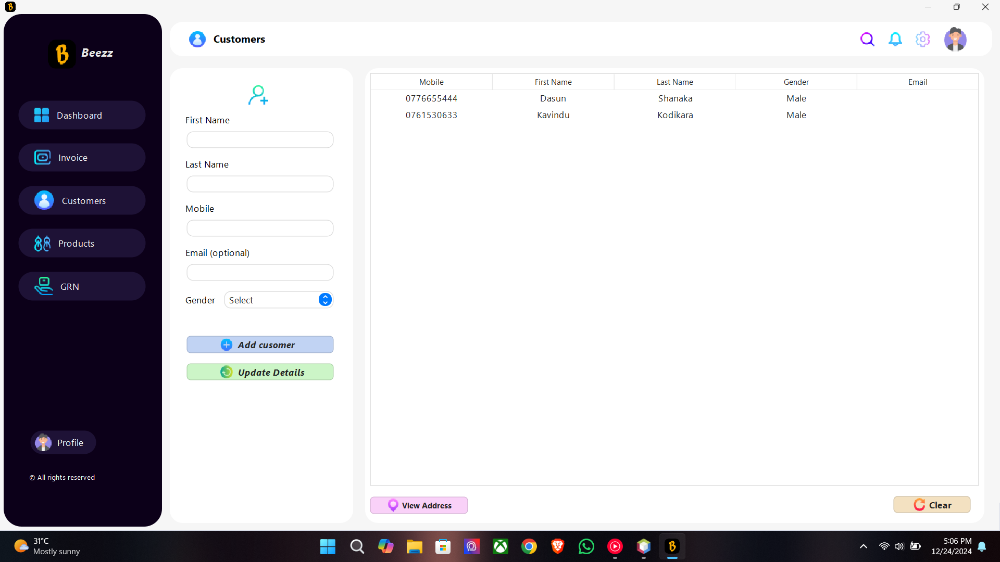
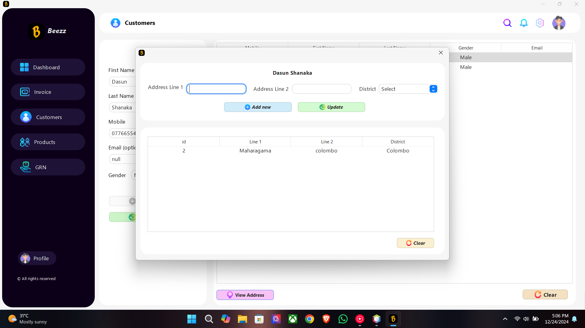
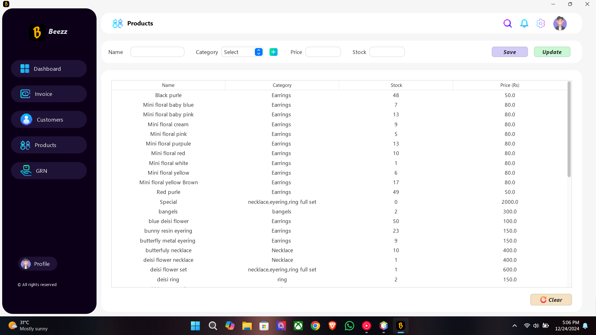
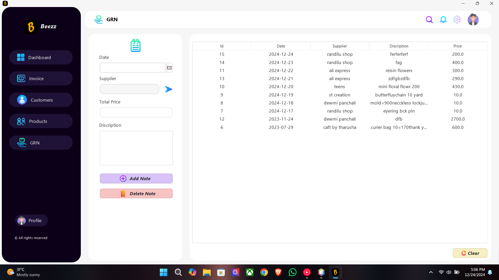

# Beezz Inventory Control System

Beezz Inventory Control is a fully functional Java SE application designed for one of my client's small resin art crafting businesse to efficiently manage their inventory and financial data. This application uses Java and MySQL to provide a smooth user experience in tracking sales, products, customers, invoices, and other critical business functions. 

## Technologies Used
- **Java SE** for the main application logic and backend development.
- **MySQL** for managing the database and storing information like invoices, products, customers, and transactions.
- **Swing** for building the user interface.
- **JDBC** for database connectivity, ensuring smooth communication between the Java application and MySQL.

## Project Features
- **Dashboard**: Get an overview of total income, expenses, profits, and a 7- and 30-day income graph.
- **Invoice Management**: Add, view, and manage invoices with automatic product suggestions and customer data filling.
- **Customer Management**: Add, update, and delete customers while managing their addresses.
- **Products Management**: Track and manage product inventory and stock levels.
- **Goods Receipt Note (GRN)**: Add small notes to track received goods.
  
---

## Overview of Pages

### 1. Dashboard

The dashboard provides an overview of the business's financial status. It displays:
- **Total Income**
- **Total Expenses**
- **Total Profit**
- **Last 7 Days Income**
- **Last 30 Days Income**

Additionally, it includes a bar chart showing:
- **Last 7 Days Income, Expenses, and Profit**

  

 
---

### 2. Invoice Interface

The invoice page allows users to manage invoices. Key features include:
- **Add New Invoice**: Users can add new invoices by typing the product name. A suggestion list will appear, and once selected, relevant fields (e.g., category, price) auto-fill.
- **Customer Selection**: If the customer is registered, selecting the customer auto-fills their details.
- **Save Invoice**: After adding products and customer information, users can save the invoice.
- **View Invoice Details**: By double-clicking an invoice in the table, users can view the invoice details such as products and customer information.

  

 

 
Select customer
  

 
Suggestion list
  

 
Invoice details
  

 

---

### 3. Customer Management

The customer page enables users to:
- **Add, Update, and Delete Customers**
- **Manage Customer Addresses**: Users can add and view customer addresses.

  

 

 

---

### 4. Products Management

This page allows users to manage products and stock levels. Features include:
- **Add New Products**: Users can add new products to the inventory.
- **Manage Stock**: View and update the current stock levels for each product.

  

 

---

### 5. Goods Receipt Note (GRN)

The GRN page allows users to:
- **Add Notes About Received Goods**: Users can add small notes regarding goods received for inventory purposes.

  

   

---
